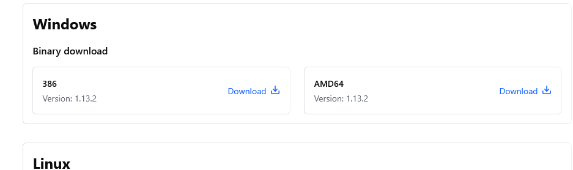
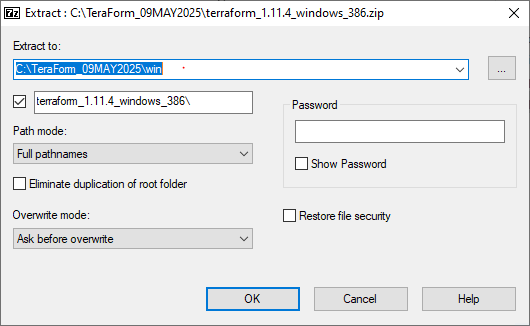
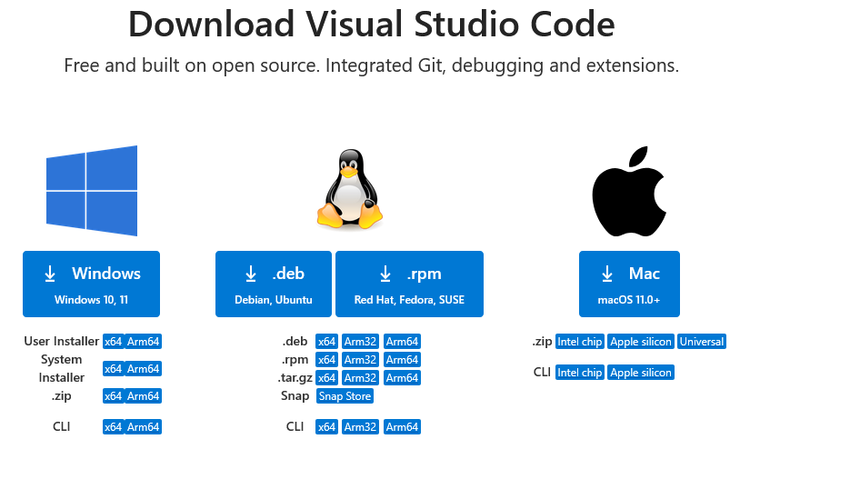
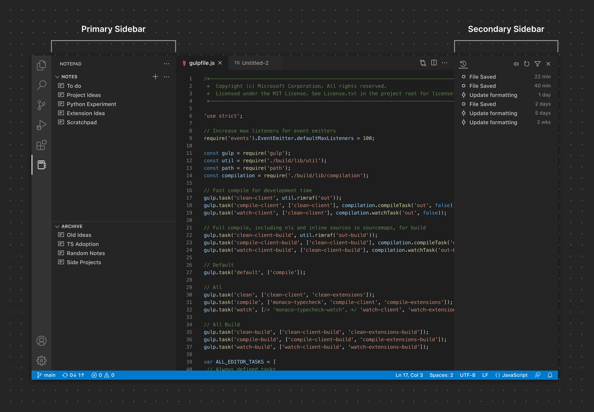
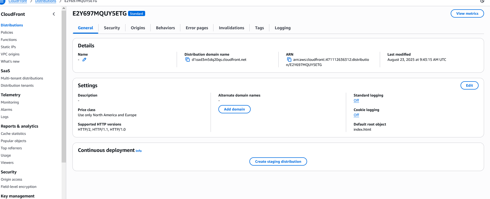

 # 🚀✨ Terraform - AWS Cloud Front - Curriculum Vitae

This small  IaC; Terraform project shows you how to publish your Curriculum Vitae using **Terraform (IaC)** and **AWS CloudFront**.  
It also demonstrates the steps how to manage your Curriculum Vitae, after converting into HTML  from MS-Office, Google Docs, PDF and deliver it through AWS Services. The aim is to showcase the power of Terraform (Ia, in combination with other Software and applications. 
The Power of Terraform means, how to create and destroy Infrastructure, using, (in this example ) AWS Cloud Services.

## 🚀 Features
- Deploys AWS CloudFront distribution via Terraform.
- Demonstrates the power of Infrastructure as Code (iMac); Terraform best practices.
- Stores and serves CV in HTML format, letting HR Managers access your Curriculum Vitae via the CloudFront URL.
- AWS Cloud Front - Curriculum Vitae, is easily customizable for personal or professional use.
- Use Microsoft Vocoder where you have the freedom to alter my details with yours, in the .html which I have I have shared with.
- The steps are for Microsoft Windows 10 Professional; Microsoft VSCode was installed for, Windows 10 Professional.
- I might do same for Linux later

## 🛠️ Technologies Used - For this Project
- **AWS Services** (CloudFront, S3, IAM).  
- **Terraform** (for Infrastructure as Code).
- **Microsoft VSCode** (Editor for Infrastructure as Code, HTTP, CSS, etc).  
- **MS Office 365 / Google Docs** (in the event your CV is with MS Office and or Google Docs).  
- **PDF**  

 ## Your  Curriculum Vitae

If you have your document (CV) in a .PDF you can use Adobe to convert to HTML using "Export PDF Tool. You can have a free trial with Adobe. However, the downside is you have to use your credit card, in a view to obtain that free 7 days.

In order to help you, I searched for options and found; https://app.gonitro.com/ They offer you a 14-day trial.

## The Method I used.

The method I adopted was, since I have my Curriculum Vitae, in Microsoft Word, and if you too have your CV in .docx, you can use MS-Word to open your document and Save AS, option MyCV.HTML. (You may assign a name as you wish).
Using the converted file, (HTML file) I have used Microsoft VS Code to create a HTML, CSS to make it more professional and presentable. I used this approach, since two of my modules (1) Internet and the Multimedia and (2) Programming the Internet for my MSc in 2013, which came handy. The attached image of my CV is self-explanatory. Or if you like the HTML, I have shared you with, you are free to armed accordingly. I mean your professional experiences, as a Show Case for a HR Manager.
A word of warning! In MS-Word, though it gives the facility you have a Document in HTML, MS-Word will generate normal HTML file. No styles, no colours and so on. Not like the one I have produced.

## Methods / Notes for; How to install terraform in Microsoft Windows 10 Professional.

In my case I had created Folder; C:\TeraForm_09MAY2025. In a view to download Terraform in a separate Folder, and Initially I executed Terraform, from this command prompt. C:\TeraForm_09MAY2025. Which is my Terraform Folder.

- Link for Terraform;https://developer.hashicorp.com/terraform/install#windows

- Click on  appropriate zip archive You will be taken here; https://developer.hashicorp.com/terraform/installScroll down to Windows Binary Download.

  

- Click on download, and you shall see a file like; terraform_1.13.2_windows_386.zip  Locate the file terraform_1.13.2_windows_386.zip, and unzip. If you have crated a Folder as explained above, or similar, it will be easier to locate your Terrafom Folder.

 
- I am using 7Zip which is a free version. https://www.7-zip.org/
- Once downloaded you should see a file like ; terraform_1.11.4_windows_386.zip
- Using 7Zip or other, right click and unzip. I have added an extra folder as WIN, telling WINZIP where to extacty my extracted file. (Pease see screen shot, for your easy reference)

- Once extracted,  you should see (a) terraform.exe and (b) LICENSE.txt.
- Right click on terraform.exe, and chose Run as Administrator.
- This will install Terraform in your local, Microsoft Windows 10 machine.
- In a view to test, if the installation was successful, using your Command Prompt, go to the folder where you have Terraform.
- In my case it c:/TeraForm_09MAY2025
- At the Command promp, example; TeraForm_09MAY2025, type terraform and press Enter key.
 

###  The Results you should see, once you type Terraform and Press Enter key at the desired Command Promt; C:\TeraForm_09MAY2025

+ Please see the Image; Your_First_Terraform_Installation_Test.png
+ Command Promt; C:\TeraForm_09MAY2025 is where I have had downloaded Terraforn and initiated.
+ Yours should be of your own, a Folder you have  created in C Drive! 

 

Hoorah!! You have a successful installation of Terraform.  ✅

## Please follow the below steps in a view to, test and configure Terraform in MS- Windows from any given prompt.

- From the Command Prompt, Change into a different directory using CD C:/(directory name) 
- Type terraform and press Enter key. Now you not see the results as above) 
- The reason is you have not set the environment variables in MS Windows.
- In a view to achieve that, on the Start (bottom left hand corner) Right Click and choose Run.
- Or from your keyboard, press the Windows Icon (left hand down) , and the letter R from your keyboard, together.
- Type sysdm.cpl
- You should see Windows System Properties ( See attached image) 
- Click on Advanced, on the right hand below, you should see  Environment Variables.
- Click on  Environment Variables. (Please see attached image)
- Click on new. (1) For the Variable Name type the path to the exact folder you have downloaded, and extracted,  terraform.exe. Mine is C:\TeraForm_09MAY2025
- Having done so, For the Variable Value, type Terraform
- Click Ok,  Ok and then Ok again.  This  shall exit you  Windows System Properties
- Now in a view to test, from your command prompt, using CD change into any given Folder and Type, Terraform. Now you should see the results as above in our ever first test after installing terraform.

## How to Configure AWS CLI in Windows, so that Terraform shall make that API to AWS Cloud

There are two parts (1) I am hoping you have an AWS Account, and (2) If you do not have an account.

## Methods / Notes: For those who does not have an AWS Account.

## How to install VScode

+ I have found myself to be very comfortable with Microsoft VSCode. At the same time, I am confident, that each one of you have your own editors. Having said that, I suggest, you may please use Microsoft VSCode for this Project! 

+ Go to (or in a Google Search, type vscode) https://code.visualstudio.com/download. Someting similar to below image.

  
+ Select Windows and download.VSCodeUserSetup-x64-1.104.0.exe, and download.  
+ Once downloaded and saved, you shall see https://code.visualstudio.com/docs/?dv=win64user.
+ The above link explains how to install and configure Visual Code.
+ I would suggest reading and understanding, if you are a first timer, or a novice. I beleive, most of you good men and woman have your skills. 
+ Now, locate the folder into which you have downloaded VSCode. I have created a folder in C:/VSCODE
+ Right click on VSCodeUserSetup-x64-1.104.0.ex, Run As Administrator.
+ Once installed, you may see a Visual Code Studio icon on your desktop.
+ click and you should see VSCode (Please see attached image)

+ Valuable link 1; Link to Visual Code user Interface; https://www.google.com/search?sca_esv=e4a95c6c96962d75&q=Visual+code+screen&spell=1&sa=X&ved=2ahUKEwiY9M7fyNWPAxUW0wIHHfweGf4QBSgAegQIDxAB&biw=1920&bih=967&dpr=1#vhid=QQO-9g1QE8jgbM&vssid=_mkzFaI7cAv-yi-gPmaHx6QY_44
+ Valuable link; Link to Visual Studio Code Sidebars; https://code.visualstudio.com/api/ux-guidelines/sidebars. I suggest you may place study and be comfortable with those. I will be very handy down the line.

## How to configure VScode for terraform

 - Microsoft VSCode was used as my HTML editor (most do),for creating and destroying IaS, in this  case,  for the infrastructure for AWS Cloud.
- I have shared the corresponding HTML file which corresponds to my CV,  (Valuable link) which is a part of Terraform, the API for AWS  CloudFront.
- It can be, within a CV one does not present their certificates. I made an extra effort,  in a view to show case. You may disregard that part.
- The HTML  was first tested on my local computer. C:/test_Drive; denzilCV.html
- After a successful test, I added the corresponding images into the same folder. If you may read the HTML file I have referred to the images within the HTML. This was a local test. 
- If you are using images similar to mine, kindly note that,  upon executing Terraform  (i) init, (ii) Terraform fmt, (iii) Terraform Plan, and finally (iv) Terraform -auto-apply.
- In a layman's way, login to your AWS Console, based on the AWS region you have used, or you are at; in my case eu-central-1. 
- From the AWS Console, you may search CloudFront,  Distributions, and you should see something similar like the screenshots I have attached. 
- For the moment, for this  mini project, you need to  first go to S3, and upload the corresponding images, into S3 creted by Terraform. Please see my belo screenshot for your easy reference. It is found uder Documemts/CloudFront_Distribute_i.png, too

- Now  being at AWS Cloudfront,  Distributions,  Copy the  link, ( Distribution Domain name) and you should see your wonderful CV!
- Here is the way CV is displayed!

  <table>
    <tr>
      <td align="center">
        <a href="Documents/">
           
          Denzil Peiris_CV_Page One
        </a>
      </td>
      <td align="center">
        <a href="Denzil Peiris_CV_Pg2.png">
           
          Denzil Peiris_CV_Page Two
        </a>
      </td>
    </tr>
    <tr>
      <td align="center">
        <a href="Documents/Denzil Peiris_CV_Pg3.png">
           
          Denzil Peiris_CV_Page Three
        </a>
     </tr>
  </table>

### If anyone needs the screen shots for AWS Cloud Front; (This mini Project ) via the AWS Console please do ask.

## Additional Resources 📖💡

- Terraform Documentation: https://www.terraform.io/docs
- AWS CloudFront Documentation: https://aws.amazon.com/cloudfront/ 
- GitHub Markdown Guide: https://aws.amazon.com/cloudfront/

This project uses Terraform to provision AWS infrastructure. The diagram below illustrates the flow;

## Points To Ponder

- S3 Bucket: Stores CV files in PDF, Word, or other formats.

- CloudFront Distribution: Delivers your CV globally with low latency.

- Terraform: Automates provisioning and deployment.

- Users: Access your CV via the CloudFront URL.

## Contributing

Contributions, issues, and feature requests are welcome!
You can fork this repository and submit pull requests.

## License

