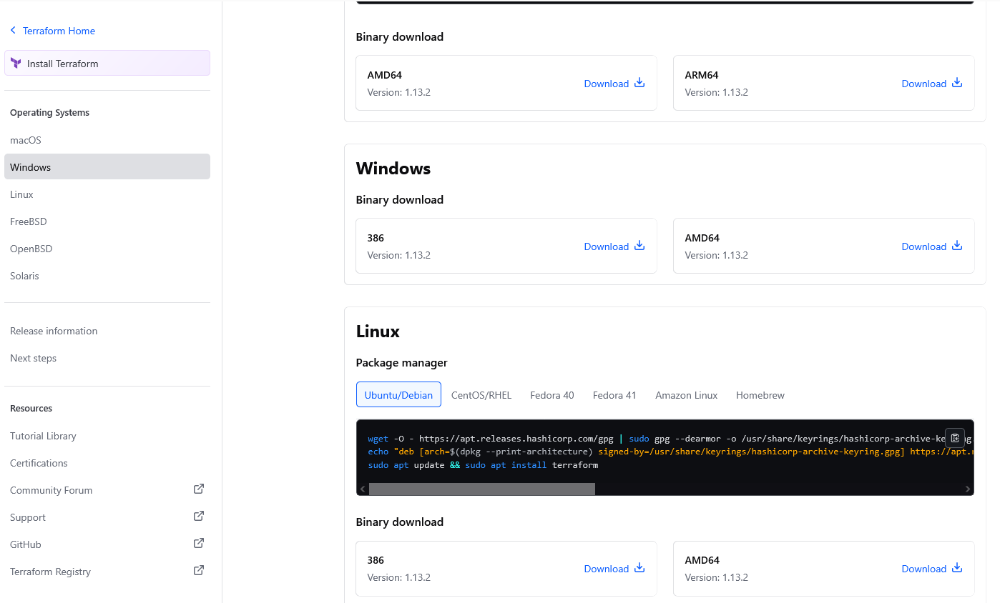
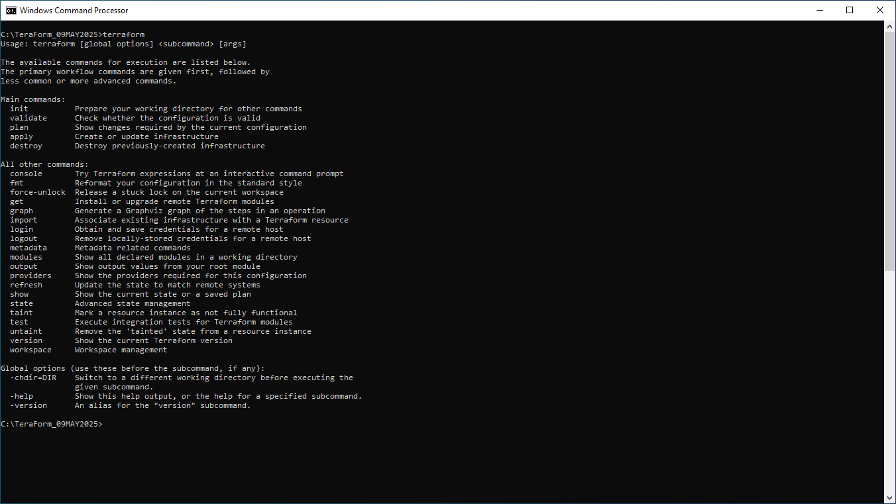
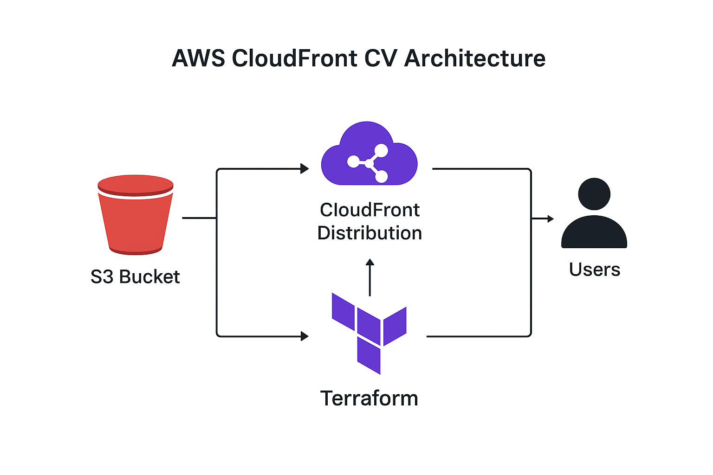

 # 🚀✨ Terraform - AWS Cloud Front - Curriculum Vitae

This small  IaS; Terraform project shows you how to publish your Curriculum Vitae using **Terraform (IaC)** and **AWS CloudFront**.  
It also demonstrates the steps how to manage your Curriculum Vitae, after converting into HTML  from MS-Office, Google Docs, PDF and deliver it through AWS services. The aim is to show case the power of Terraform, in combination with other Software and applications. 
The Power of Terraform means, How to Create and Destroy Infrastructure, using, (in this example ) AWS Cloud Services.

## 🚀 Features
- Deploys **AWS CloudFront** distribution via Terraform  
- Demonstrates the power of **Infrastructure as Code (IaC); Terraform** best practices.  
- Stores and serves CV in HTML format, letting HR Mansgers access your Curriculum Vitae via the CloudFront URL.
- AWS Cloud Front - Curriculum Vitae, is easily customizable for personal or professional use.
- Use Microsoft VSCode you have the freedom to alter my details with yours, in the .html I have  shared with.
- The steps are for Microsoft Windows 10 Professional.
- I might do same for Linux later. 

## 🛠️ Technologies Used - For this Project
- **AWS Services** (CloudFront, S3, IAM).  
- **Terraform** (for Infrastructure as Code).
- **Microsoft VSCode** (Editor for Infrastructure as Code, HTTP, CSS, etc).  
- **MS Office 365 / Google Docs** (in the event your CV is with MS Office and or Google Docs).  
- **PDF**  

 ## Your  Curriculum Vitae

If you have your document (CV) in a .PDF you can use Adobe to convert to HTML using  "Export PDF Tool.  You can have a free trial with Adobe. Howvr the downside is you have to use your credit card,  in a view to obtaion that free 7 days.

In order to help you, I searched for options and found; https://app.gonitro.com/
They offer you a 14 day trial. 

## The Method I used.

The method I adopted was, since I have my Curriculum Vitae, in Microsoft Word, and if you too have your CV in .docx, you can use MS-Word to open your document and SaveAS, optin  MyCV.HTML. (You may assign a name as you wish).

Using the converted file, (HTML file) I have used Microsoft VS Code to create a HTML, CSS to make it more professional and presentable. I used this approach, since two of my modules (1) Internet and the Multimedia and (2) Programming the Internet for my MSc in 2013, which came handy. The attached image of my CV is self explanatory. Or if you like the HTML I have shared you with, you are free to ammed accordingly. I mean your professional experiences, as a Show Case for a HR Manager.

A word of warning!  In MS-Word, though it gives the facility yo have a Document in HTML, MS-WOrd will generate normal HTML file. No styles, no colours and so on. Not like the one I have produced.

## Methods / Notes for; How to install terraform in windows.

In my case I had created Folder; C:\TeraForm_09MAY2025. In a view to to download Terrafrom in a seperate Folder, and Initilally I execuited Terraform, from this command prompt. C:\TeraForm_09MAY2025. Which is my Terraform Folder.

-Link for Terraform; https://developer.hashicorp.com/terraform/tutorials/aws-get-started/install-cli (Screenshot attached)

- Click on  appropriate zip archive You will be taken here; https://developer.hashicorp.com/terraform/installScroll down to Windows Binary Download. (Screenshot attached)

  

- Click on download, and you shall see a file like; terraform_1.13.2_windows_386.zipLocate the file terraform_1.13.2_windows_386.zip, and unzip.  (Screenshot attached)

  
-I am using 7Zip which is a free version. https://www.7-zip.org/ 
- Once unzipped, you should see a file; terraform_1.13.2_windows_386Double click and you should see (a) terraform.exe and (b) LICENSE.txtRight click on terraform.exe, Run as Administrator. This will install Terraform in your local, Microsoft Windows machine.
- In a view to test, if the installation was successful,  using your Command Prompt, go to the folder where you have Terraform.  In my case it is; C:\AWS_Projects_MB_13MAY2025\Test_Drive_10SEP2025\T13SEP2025>
- At the Command prompt: example C:\AWS_Projects_MB_13MAY2025\Test_Drive_10SEP2025\T13SEP2025>, type terraform and press Enter key. 
- Now you should see the below;

#  The Results you should see, once you type Terraform and Press Enter key at the desired Command Promt; C:\TeraForm_09MAY2025

+ Please see the Image; Your_First_Terraform_Installation_Test.png 

 

Hoorah!! You have a successful installation of Terraform.  ✅

## However, now try this to test and configure Terraform in MS- Windows from any given prompt.

- From the Command Prompt, Change into a different directory using CD C:/(directory name) 
- Type terraform and press Enter key. Now you not see the results as above) 
- The reason is you have not set the environment variables in MS Windows.
- In a view to achieve that, on the Start (bottom left hand corner) Right Click and choose Run.
- Or from your keyboard, press the Windows Icon (left hand down) , and the letter R from your keyboard, together.
- Type sysdm.cpl
- You should see Windows System Properties ( See attached image) 
- Click on Advanced, on the right hand below, you should see  Environment Variables.
- Click on  Environment Variables. (Please see attached image)
- Click on new. (1) For the Variable Name type the path to the exact folder you have downloaded, and extracted,  terraform.exe. Mine is C:\TeraForm_09MAY2025
- Having done so, For the Variable Value, type Terraform
- Click Ok,  Ok and then Ok again.  This  shall exit you  Windows System Properties
- Now in a view to test, from your command prompt, using CD change into any given Folder and Type, Terraform. Now you should see the results as above in our ever first test after installing terraform.

## How to Configure AWS CLI in Windows, so that Terraform shall make that API to AWS Cloud

There are two parts (1) I am hoping you have an AWS Account, and (2) If you do not have an account.

## Methods / Notes: For those who does not have an AWS Account.

## How to install VScode

+ I have found myseld to be very comfortable with Microsoft VSCode. At the same time, I am confiden, that each one of you have your own editors. Having said that, I suggest you may please use Microsoft VSCode for this Project! 

+ Go to (or in a Google Search, type VSCODe) https://code.visualstudio.com/downloadSelect Windows and download.VSCodeUserSetup-x64-1.104.0.exeOne downloaded and saved, you shall see https://code.visualstudio.com/docs/?dv=win64user.The above link explains how to install and configure Visual Code. I would suggest reading and understanding, if you are a first timer, or a novice.
  
+ On the other hand, locate the folder into which you have downloaded VSCode.Right click on VSCodeUserSetup-x64-1.104.0.ex, Run As Administrator. Once installed, you may see a Visual Code Studio icon on your desktop, click and you should see VSCode (Please see attached image)

+ Link to Visual Code user Interface; https://www.google.com/search?sca_esv=e4a95c6c96962d75&q=Visual+code+screen&spell=1&sa=X&ved=2ahUKEwiY9M7fyNWPAxUW0wIHHfweGf4QBSgAegQIDxAB&biw=1920&bih=967&dpr=1#vhid=QQO-9g1QE8jgbM&vssid=_mkzFaI7cAv-yi-gPmaHx6QY_44

+ Link to Visual Studio Code Sidebars; https://code.visualstudio.com/api/ux-guidelines/sidebars. I suggest you may place study and be comfortable with those. I will be very handy down the line.

## How to configure VScode for terraform

 - Microsoft VSCode was used as my HTML editor, as much as for creating and destroying IaS, in this  case, AWS Cloud.

- I have shared the corresponding HTML file which corresponds to my CV,  which is a part of Terraform, the API for AWS  CloudFront.  It can be that in a  CV one does not present their certificates. I made an extra effort,  on a view to show case. You may disregard that part. 

- The HTML  was first tested on my local computer. C:/test_Drive; denzilCV.html  After a successful test, I added the corresponding images into the same folder. If you may read the HTML file I have referred to the images within the HTML. This was te local test.
 
- If you are using images like I did, upon executing Terraform init, Terraform fmt, Terraform Plan, and finally Terraform -auto-apply. 

- In a layman's way, login to your AWS Console, based on the AWS region you have used, or you are at; in my case eu-central-1. 

- From the AWS Console, you may search CloudFront,  Distributions, and you should see something similar like the screenshots I have attached. 

- For the moment, for this  mini project, you need to  first go to S3, and upload the corresponding images, into S3 creted by Terraform. Please see my screenshot.

- Now  being at AWS Cloudfront,  Distributions,  Copy the  link, ( Distribution Domain name) and you should see your wonderful CV!

- Here is the way CV is displayed! 

### If anyone needs the screen shots for AWS Cloud Front; (This mini Project ) via the AWS Console please do ask.

## Additional Resources 📖💡

- Terraform Documentation: https://www.terraform.io/docs
- AWS CloudFront Documentation: https://aws.amazon.com/cloudfront/ 
- GitHub Markdown Guide: https://aws.amazon.com/cloudfront/

This project uses Terraform to provision AWS infrastructure. The diagram below illustrates the flow;

## Points To Ponder

- S3 Bucket: Stores CV files in PDF, Word, or other formats.

- CloudFront Distribution: Delivers your CV globally with low latency.

- Terraform: Automates provisioning and deployment.

- Users: Access your CV via the CloudFront URL.

## Contributing

Contributions, issues, and feature requests are welcome!
You can fork this repository and submit pull requests.

## License

